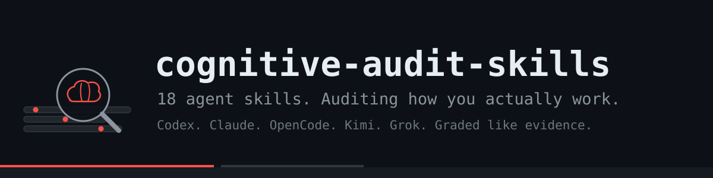

<div align="center">



[](LICENSE)

[](https://github.com/anthropics/skills)

**18 skills that teach an AI agent to audit how you actually think, decide, debug, and build.**

Distilled from longitudinal behavior-analysis practice.
Aviation. Medicine. Intelligence analysis. Pointed at your own transcripts.

</div>

---

## The problem

Agents can code and browse.
Ask one how you work, and it writes a horoscope:
"ambitious, curious, moves fast, should communicate clearly."

Nobody trained it to treat transcripts as evidence.
Longitudinal behavior analysis did that training for investigators for a century.
We turned it into files an agent can load.

## The filter

Every finding had to pass one test:

> **Would this still be interesting if the subject already knew it?**

Flattery fails instantly. So does anything visible inside a single session.
What survives are patterns that took months of interactions to form and can
only be seen across many.

## What it is not

Not a personality quiz. Not therapy. Not a clinical assessment.
No diagnoses, no IQ, no MBTI, no astrology archetypes.
Observable work behavior is the entire territory.

## The skills

| Skill | Use it for |
|---|---|
| [audit-router](skills/audit-router/) | Which skill fits the question you just got |
| [source-discovery](skills/source-discovery/) | Inventory every platform before claiming coverage |
| [evidence-hygiene](skills/evidence-hygiene/) | Secrets stay in the corpus |
| [episode-method](skills/episode-method/) | Attribute correctly, analyze episodes not messages |
| [cognitive-loop-map](skills/cognitive-loop-map/) | How intent becomes learning, per task type |
| [framing-planning](skills/framing-planning/) | Problem representation vs action timing |
| [calibration-audit](skills/calibration-audit/) | Expected vs actual, graded honestly |
| [debugging-trees](skills/debugging-trees/) | Reconstruct hypothesis trees on bug hunts |
| [failure-loops](skills/failure-loops/) | What the second move after failure costs you |
| [bias-candidates](skills/bias-candidates/) | Patterns that survive counterevidence only |
| [collaboration-audit](skills/collaboration-audit/) | Prompts in, verification out, understanding kept |
| [learning-tracker](skills/learning-tracker/) | Lessons learned once vs forgotten forever |
| [attention-ledger](skills/attention-ledger/) | Where time went vs where value came out |
| [model-matrix](skills/model-matrix/) | Which model for which kind of work |
| [contradiction-finder](skills/contradiction-finder/) | Says X, data says Y |
| [blindspot-miner](skills/blindspot-miner/) | Findings invisible from any single session |
| [report-writer](skills/report-writer/) | One page of truth, ten findings, then depth |
| [prospective-kit](skills/prospective-kit/) | Falsifiable predictions for future sessions |

Start with [audit-router](skills/audit-router/). It points to the rest.

## Install

Works with Claude Code, opencode, Cursor, Codex CLI, or any agent that reads markdown.

```bash
npx skills add YannisKiefer/cognitive-audit-skills
```

Or the manual way:

```bash
git clone https://github.com/YannisKiefer/cognitive-audit-skills.git
cp -r cognitive-audit-skills/skills/* ~/.claude/skills/
```

Or paste any SKILL.md into your system prompt.

Each skill follows the [agent skills format](https://github.com/anthropics/skills):
YAML frontmatter with `name` and `description`, body in plain English.

## Example

See [EXAMPLES.md](EXAMPLES.md). One finding card that survives
counterevidence - and one horoscope line that doesn't.

## Method and sources

[METHOD.md](METHOD.md) shows the pipeline: discover, intake, reconstruct,
analyze, synthesize, report, instrument forward.

[SOURCES.md](SOURCES.md) lists the research behind the method -
metacognition, calibration, programmer cognition, automation bias,
human-AI collaboration - with established findings separated from
emerging ones.

## Rules baked into every skill

1. Behavior over labels.
2. Never blame the human for the model's behavior.
3. Three tasks, three months, three contexts before a pattern exists.
4. Secrets never leave the corpus.
5. Surprising and actionable beats flattering.

## License

MIT. Fork it, ship it, audit yourself with it.

<div align="center">
<sub>Built by <a href="https://github.com/YannisKiefer">Yannis Kiefer</a></sub>
</div>
